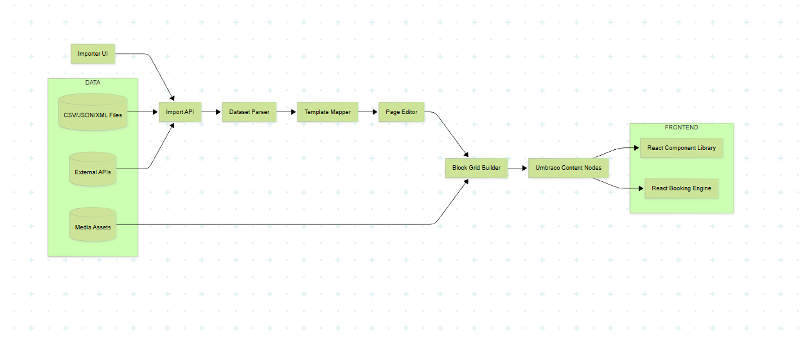

# System Architecture

## Overview

This document describes the architecture of the Umbraco Site Kit with Booking Engine integration.

## Architecture Diagram



## Components

### 1. Umbraco CMS

The Umbraco CMS serves as the content management system and provides:

- **Content Types**: Hotel, Room, Offer, Event (and any custom types)
- **API Endpoints**:
  - `GET /api/hotels` - List all hotels
  - `GET /api/hotels/{id}` - Get hotel details
  - `GET /api/hotels/{id}/rooms` - Get rooms for a hotel
  - `GET /api/hotels/{id}/offers` - Get offers for a hotel
  - `GET /api/hotels/{id}/availability` - Get basic availability structure
  - `POST /api/importer` - Stub endpoint for content import (stores in temp area)
  - `POST /api/seed/create-demo-hotel` - Create demo hotel content

- **Razor Views**: Main site pages (hotelList, hotel, room)
- **Razor Components**: Universal partials (Hero, Gallery, FAQ, Features, Cards, BookingEngine)

### 2. Booking Engine Backend (`/engine`)

Node.js + TypeScript service providing:

- **Routes**:
  - `GET /availability?productId&from&to` - Check availability for a product
  - `POST /book` - Create a booking
  - `GET /health` - Health check

- **Adapters**: Local JSON adapter for mock availability data
- **Services**: AvailabilityService and BookingService handle business logic

### 3. Razor Components (Main Frontend)

Universal, reusable Razor partials with JavaScript:

- **Hero** - Hero section with heading, tagline, image
- **Gallery** - Image gallery with JavaScript lightbox
- **FAQ** - Accordion FAQ section with JavaScript toggle
- **Features** - Feature grid display
- **Cards** - Card grid (configurable columns)
- **BookingEngine** - Wrapper that embeds React booking engine

**All components use vanilla JavaScript for interactivity - no React overhead.**

### 4. React Booking Engine UI

Standalone, embeddable React booking engine:

- **Structure**:
  - `components/ui/` - Primitive UI components (Button, Input, Card, etc.)
  - `components/booking/` - Booking-specific components (CalendarSelector, AvailabilityPanel, BookingForm, ConfirmationScreen)
  - `services/api/` - Availability + booking service classes
  - `services/adapters/` - API ↔ domain adapters
  - `hooks/` - useAvailability, useBookingFlow, etc.
  - `app/` - BookingApp.tsx (main entry point)

- **Features**:
  - Product selection
  - Date/date-range selection
  - Availability checking via Booking Engine backend
  - Booking form with guest details
  - Confirmation screen with booking reference
  - Design tokens system
  - Test IDs on all interactive elements

- **Embedding**: Loaded via script tag in `BookingEngine.cshtml` partial

## Data Flow

```
User visits Razor page
    ↓
Razor view renders
    ↓
Razor partials render components (Hero, Gallery, FAQ, etc.)
    ↓
JavaScript adds interactivity (lightbox, accordion, etc.)
    ↓
If booking needed → BookingEngine.cshtml partial loads React component
    ↓
React booking engine fetches from Booking Engine backend
    ↓
Booking Engine backend uses adapters for availability
```

## Universal Design

All Razor components are **universal** and work for:
- Hotels
- Event venues
- Stadiums & arenas
- Attractions
- Multi-location businesses
- Tourism boards
- Any structured-content domain

Components are industry-agnostic and reusable across different site types.

## Integration Points

1. **Razor → React**: `BookingEngine.cshtml` partial loads React component via script tag
2. **Razor → API**: Razor views fetch data from Umbraco APIs via JavaScript fetch
3. **React → Backend**: React booking engine calls Booking Engine backend APIs
4. **Umbraco → Content**: Content editors manage content via Umbraco backoffice

## Technology Stack

- **Backend**: Umbraco CMS (.NET 9), Node.js + TypeScript (Booking Engine)
- **Frontend**: Razor views + JavaScript (main site), React + TypeScript (booking engine)
- **Database**: SQL Server
- **Containerization**: Docker Compose
- **Styling**: Tailwind CSS

## Summary

- ✅ **Main Frontend**: Razor components + JavaScript (universal, reusable)
- ✅ **React**: ONLY for booking engine (embeddable)
- ✅ **Integration**: Seamless via Razor partials
- ✅ **All Services**: Running in Docker
